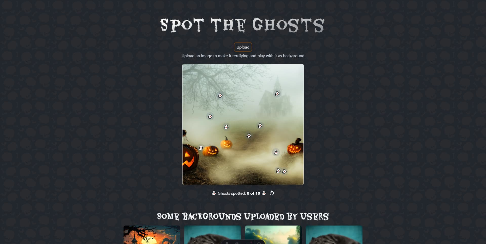

# 
# Spot the Ghosts

> Web application mini-game in which the player must click on randomly appearing ghosts. The score increases with each ghost removed. It is built using Astro with TypeScript, TailwindCSS and the Cloudinary SDK for Astro.

## Demo 🎮

Here is a working live demo:\
https://spot-the-ghosts.netlify.app

## Technologies 🛠️

The following technologies were used to develop this application:

- npm
- Astro
- Cloudinary
- TypeScript
- TailwindCSS
- JavaScript

## Author

- **Name:** Jordi Martinez Jimenez
- **Contact:** 
- **Demo:** [Demo](https://spot-the-ghosts.netlify.app)